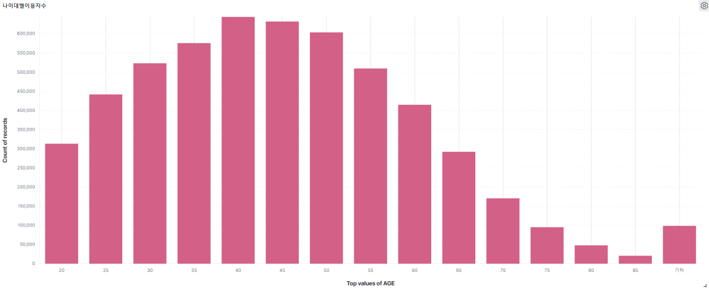

# ELK_WooriCard

## 프로젝트 소개

- 우리카드로부터 제공받은 실제 사용자 데이터를 활용해 ELK를 기반으로 데이터 시각화 및 분석, 나아가 새로운 고객유치 및 이용량 증가를 위한 방안을 제시한다.
- Virtual Box 내에 Ubuntu 상에 설치한 ELK 내부에 카드 데이터 csv를 삽입해 새로운 Index를 생성하고 이를 활용한다.

## 사용 환경

## 데이터 시각화

### 분기별 의류
 

### 나이대별 총소비량
 

### 성별별 주방용품
 

### 지역별 교육비
 

### 나이대별 이용자수
 

## 데이터에 대한 팀원들의 견해

팀원들의 공통된 예측과 다른 결과가 시각화를 통해 확인되었다. 

#### 1. 사람들은 2Q에 의류 소비를 가장 많이 할까?

겨울옷의 가격대가 더 높기때문에 당연히 4분기에 평균 옷 소비금액이 높을것이라는 예상과는 달리 데이터는 **2분기**에 가장 높은것으로 확인되었다. 일반적으로 생각해보았을때 겨울철 외투 비용과 여름철 옷 비용은 크게 차이가 나기 때문에 우리카드 데이터의 신뢰도 확인이 필요하다는 결론이 났다.

#### 2. 평균 교육비가 가장 높은 지역은 제주도에 거주하는 사람들?

서울이나 경기지역으로 갈수록 교육비가 가장 높을 것이라 예상했던 바와 달리 세종, 제주지역에 평균 교육비가 가장 높은것으로 확인되었다.

[출처] : https://www.nextplay.kr/news/articleView.html?idxno=7261

뉴스기사와 실데이터의 분석내용이 일치하지 않는것으로 보아 실데이터의 신뢰도와 객관성 확인이 필요하다는 결론이 났다.

#### 3. VVIP들의 총 소비 금액은 왜 적을까?

## 데이터를 통한 우리카드 사용자 예측하기
우리카드의 카드 중 **카드의 정석 포인트**는 우리카드의 새로운 유입을 이끌어가는 대표적인 카드다.

- 카드의 정석 포인트 혜택

출처: 카드 고릴라
 

- 사용자들의 1년 소비 금액 예측
 

기존 카드의 정석 point 혜택

## 우리카드 전략 제시

새로운 카드의 정석 point 혜택

