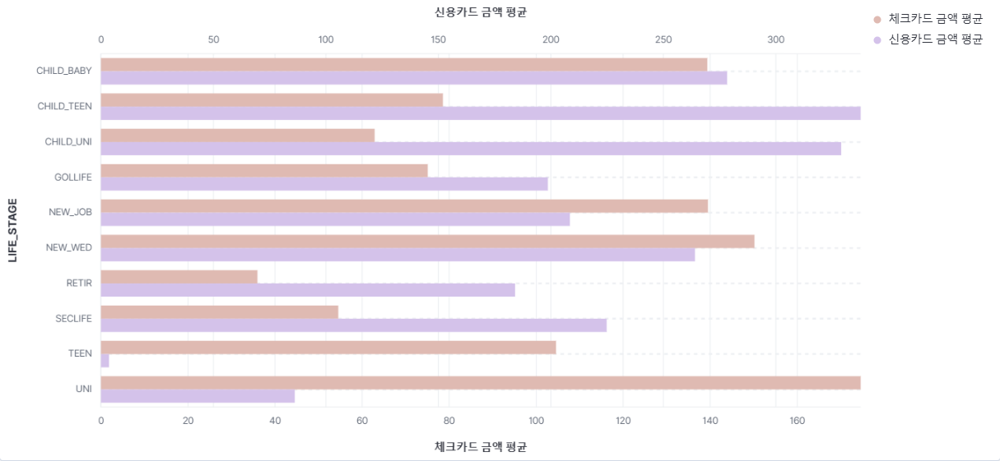

# ELK_WooriCard

## 프로젝트 소개

- ㅇㅇ카드의 실제 사용자의 **대용량 데이터**를 활용해 **ELK**를 기반으로 데이터 시각화 및 분석, 나아가 새로운 고객유치 및 이용량 증가를 위한 방안을 제시한다.
- **Virtual Box 내에 Ubuntu 상에 설치한 ELK 내부에 카드 데이터 csv를 삽입**해 새로운 Index를 생성하고 이를 활용한다.

## 사용 환경

## 데이터 시각화

### < 생애 주기별 체크/신용카드 사용 금액 현황 >

- 체크카드 최대 이용 고객군 : 대학생(UNI)
- 신용카드 최대 이용 고객군 : 의무교육 연령대 자녀를 둔 부모(CHILD_TEEN)

✅ 체크카드는 주로 소득이 제한적인 대학생 고객군에서 최대 이용량을 보이며, 이는 사회 초년생의 소비 성향을 반영한다.
 
✅ 신용카드는 자녀 교육비와 생활비 등 고정 지출을 관리하려는 초중고 자녀를 둔 부모 고객군에서 가장 많이 사용된다.

 

### < 거주 지역별 자동차 정비 및 유지 비용 - 분기별 >

- 자동차 정비 및 유지 비용이 높은 고객 지역 : 전남, 전북
- 자동차 정비 및 유지 비용이 낮은 고객 지역 : 서울, 경기

✅ 전라남도와 전라북도는 상대적으로 교통 인프라가 부족하거나 차량 이동거리가 길어 정비와 유지가 자주 필요할 수 있다고 분석된다.
 
✅ 서울과 경기 지역은 교통 인프라가 잘 발달하고, 이동거리가 상대적으로 짧아 자동차 유지비용이 낮게 나타나는 경향을 보인다.

 

### 분기별 의류
 

### 나이대별 총소비량
 

### 성별별 주방용품
 

### 지역별 교육비
 

### 나이대별 이용자수
 

## 데이터에 대한 팀원들의 견해

팀원들의 공통된 예측과 다른 결과가 시각화를 통해 확인되었다. 

#### 1. 사람들은 2Q에 의류 소비를 가장 많이 할까?

겨울옷의 가격대가 더 높기때문에 당연히 4분기에 평균 옷 소비금액이 높을것이라는 예상과는 달리 2분기의 의류 매출이 높게 발생했다.

[영원무역(홀딩스)'영업이익 1조 클럽' 쾌거](https://www.itnk.co.kr/news/articleView.html?idxno=71143)

위에서 언급한 뉴스는 '노스페이스' 브랜드 라이센스 보유사인 영원무역의 1조 매출 달성 뉴스이다.

해당 데이터가 존재하는 22 ~ 23년의 경우 해당 브랜드가 열풍이 불어 수 많은 패딩이 소비 되었고, 주력 모델인 눕시 패딩의 경우 소비자가 368,000원에 판매되었다.

수 많은 사람들이 패딩을 소비했음에도 3Q ~ 4Q에 비해 더 높은 의류 소비를 했다는 것에 의문을 갖었다.

#### 2. 평균 교육비가 가장 높은 지역은 제주도에 거주하는 사람들?

#### 3. 최상위 등급의 총 소비 금액은 왜 적을까?

ㅇㅇ카드는 등급을 나누는 것이 타 카드사 대비 낮은 기준을 갖고 있다.

이는 사용자들의 평균 사용 금액치가 타 카드사 대비 낮기 때문일 것이라 예측했다.

## 데이터를 통한 ㅇㅇ카드 사용자 예측하기
ㅇㅇ카드의 카드 중 **🐝 포인트 카드**는 ㅇㅇ카드의 새로운 회원 유입을 이끌어가는 대표적인 카드다.

-  🐝 포인트 카드 혜택

 

기존 🐝 포인트 카드 혜택

출처: 카드 고릴라

🐝 포인트 카드를 삼성페이에 등록 후 결제 시 추가 3% 적립 혜택을 통해 총 3.8%의 적립이 가능해진다.

한달 최대 적립 금액인 5만점을 채우기 위해서는 130만원을 사용하면 된다.

1년 사용 금액 : **130만원 X 12달 = 1600만원** 이라 계산할 수 있다.

이는 1000만원 이상 2500만 미만의 소비를 하는 24 등급에 해당한다.

서브 카드로 🐝 포인트 카드를 사용하면서 혜택을 모두 채우기 위해 사용하는 사용자들이 많을 것이라 생각했으며 이로 인해 24 등급에 속한 사용자가 다수일 것이라 생각했다.

실제 주어진 csv 파일을 시각화 했을 때 24 등급이 총 소비 금액 7000억으로 가장 많이 분포하고 있음을 확인할 수 있다. 

그 다음 많이 분포하는 등급인 23의 경우도 🐝 포인트 카드의 최대 적립을 채우고도 조금 더 사용하는 사용자일 것이라 예상되었다.

보통 🐝 포인트 카드는 사용자들의 주 이용 카드로 사용되지 않으며 일명 서브 카드에 속한다.

이는 △△ 카드의 더모아와 같은 적립 혜택이 더 좋은 카드가 존재하고 있기 때문이다. 

서브 카드로 사용하는 사람들이 대다수라는 생각이 들었고 이로 인해 일관적의 데이터가 모아지지 않을 수도 있을 것이다고 가정했다.

## ㅇㅇ카드 전략 제시

새로운 🐝 포인트 카드 혜택

이제는 🐝 포인트 카드의 혜택이 줄어든 것을 확인할 수 있다. 

적립율이 줄어들었으며 특히 적립 한도가 최대 2만 포인트로 절반 이상 줄어들게 되었다. 

카드 가맹점 수수료율은 시간이 지남에 따라 지속적으로 줄어들게 되었으며 이로 인해 카드 사용율을 증가시키는 전략을 통해 카드사 수익 극대화 전략은 어려움을 겪게 되었다.

특히 적립 혜택만을 채우고 사용하지 않는 사람들이 존재한다면 3.8%의 페이백을 이루어지며 카드 수수료를 통해 ㅇㅇ카드 가맹점인 최대 수수료인 3%를 거두어들인다 가정해도 0.8%의 손해가 발생하는 것이다.

그러나 가맹점의 높은 비율은 우대 수수료율을 적용받으며 연매출 30억 이하 중소 사업체의 경우 최대 1.5%의 수수료만 지불하면 된다.

이로 인해 3.8%의 페이백 혜택을 주는 것은 사실상 더 큰 손실을 불러일으킬 것이다.

따라서 단순히 많은 금액 결제를 유도해 가맹 수수료로 얻는 수익을 극대화 하는 방식 대신 새로운 방안을 고안해야된다.

#### 1. 수익성 전략

데이터를 통해 분석을 하면서 처음 생각했던 전략 중 하나는 vvip의 소비를 늘릴 수 있는 유도책을 마련하는 것이었다.

그러나 ㅇㅇ카드의 vvip의 기준은 1년간 1억 이상 소비를 한 사용자다.

이는 다른 카드사들에 비해 더 낮은 기준치를 보여준다.

ㅁㅁ 카드의 vip 선정 기준을 보면 비교적 높은 기준치를 확인할 수 있다.

만약 3000명만 VVIP로 선정한다면 ㅇㅇ카드의 vvip의 소비 금액에 대입했을 때 2년간 700억을 소비하게 되므로 1년간 350억, 1인당 연간 천만원의 소비를 한다는 결과가 나온다.

 따라서 ㅇㅇ카드의 vvip는 3000명보다 훨씬 못미친다 예상했다.

 이로 인해 타켓으로 해야하는 소비층은 23 ~ 24 등급이 되어야 한다 생각했다.

카드사의 주 매출은 디지털 전환 및 융합이라는 흐름 아래 다각화 되어가고 있다.

특히 그룹사 내 서비스를 융합적으로 제공하는 것 뿐 아니라 외부 커머스와 연동하거나 자체적인 쇼핑몰을 운영하는 등 하나의 허브가 되었다.

우선적으로 카드사 자체적으로 줄 수 있는 혜택 중 수익성을 올릴 수 있는 방안을 고민했다.

따라서 카드 단기 대출 서비스의 금리 우대 혜택을 23 ~ 24 등급에 존재하는 회원을 대상으로 차별적 혜택을 주는 것을 제안한다.

물론 2개의 등급에 대해서만 우대 혜택을 주는것은 상위 등급의 사용자 이탈을 불러일으킬 수 있다.

따라서 등급을 부여받은 사용자들에게 전체적인 혜택을 부여하고 그 중 23 ~ 24 등급에 해당하는 사용자들에게 비율적으로 계산했을 때 최대 혜택을 받을 수 있는 범위를 산정 및 제공한다.

#### 2. ㅇㅇ카드를 메인 카드로!

데이터를 분석하면서 예상과 다른 결과가 나온 이유는 ㅇㅇ카드를 '주카드'로 사용하는 사람의 수가 적기 때문이라 생각했다. 

**그렇다면 oo카드 사용률을 높이려면??**
oo카드 사용률을 높여, 메인카드로 만들기 위해서 카드 등급별 혜택에 변화를 주어 기존 고객들을 유치시킴과 동시에 더 높은 등급으로 업그레이 하도록 유도하는 방법을 생각해보았다.

위는 oo카드 등급별 혜택을 정리해놓은 표이다.
등급별 카드 주요 혜택을 정리해보면 다음과 같다.

 

**골드**
- 전용 상담센터: 1588-5600
- 무료 SMS 서비스: 승인 내역 무료 알림
- 무이자 할부: 연중 상시 2~3개월
- oo마켓 할인쿠폰: 이벤트 추첨 혜택

 

**플래티넘**
+ 전용 상담센터: 1588-5600
+ 무료 SMS 서비스: 승인 내역 무료 알림
+ 무이자 할부: 연중 상시 2~3개월
+ oo은행 수수료 면제: 월 10회
+ oo마켓 할인쿠폰: 30% 할인(최대 1만 원)

 

**VIP**
+ 전용 상담센터: 1588-5600
+ 무료 SMS 서비스: 승인 내역 무료 알림
+ 무이자 할부: 연중 상시 2~3개월
+ oo은행 수수료 면제: 월 20회
+ ooWON마켓 할인쿠폰: 30% 할인(최대 2만 원)

 

**VVIP**
+ 전용 상담센터: 1588-5600
+ 무료 SMS 서비스: 승인 내역 무료 알림
+ 무이자 할부: 연중 상시 2~5개월
+ oo은행 수수료 면제: 월 30회
+ 바우처 제공: 공항 라운지 이용권 2매 또는 골프장 무료 커피 4잔 중 선택
+ 우리WON마켓 할인쿠폰: 50% 할인(최대 3만 원)

  

이 외에 카드 가맹점과의 제휴혜택에 대해서는 등급별로 차이가 없는것을 확인했다.
Gold 등급 회원들이 플래티넘 등급으로 업그레이드 하도록 플래티넘 등급에 추가 제휴혜택을 부여하는 방법이 있다.
예를들어 **카페(스타벅스 등), 음식점(패스트푸드점, 뷔페 등), 혹은 특급호텔 객실 및 식음업장 10% 추가 할인** 혜택을 플래티넘 등급에 부여하도록 정하며 Gold회원 고객들의 카드사용을 유도한다. 
  

출처 : 카드 고릴라

현재 카드 플랫폼에서 인기 순위 상위 5개를 보여주는 화면이다.

그 중 1위 카드의 경우 혜택을 보면

해외 결제에 대해서 한도가 존재하지 않는 카드라는 점을 주목할 필요가 있다.

ㅇㅇ 카드의 고 연회비 카드 중 해외 결제 및 쇼핑에 대한 혜택을 주는 카드가 존재한다.

그러나 23 ~ 24 등급에 존재하는 회원들이 10만원 이상의 연회비를 지불하면서 사용할 확률이 적다고 판단했다.

과거 🐝 포인트 카드는 해외 결제에 대한 포인트 적립을 진행하지 않았다.

현재 발급 중단 후 새로 출시된 🐝 포인트 카드의 경우 해외 결제에 대해 적립이 진행하지만 한도가 존재한다.

따라서 주력 카드인 🐝 포인트 카드에 해외 결제에 대한 한도를 완화시키는 과정을 통해 소비 금액을 늘릴 수 있다고 생각했다.

또한 해외 결제를 자주 하는 고객은 소비를 많이하는 소비자일 확률이 높을 것이라 예상했다. 이를 통해 객단가를 올릴 수 있을 것이라 생각, 제안한다.

그리고 ㅇㅇ카드를 주카드로 사용하게 되면 보다 서브 카드가 아니기에 보다 정확한 데이터를 쌓을 수 있을 것이다.
